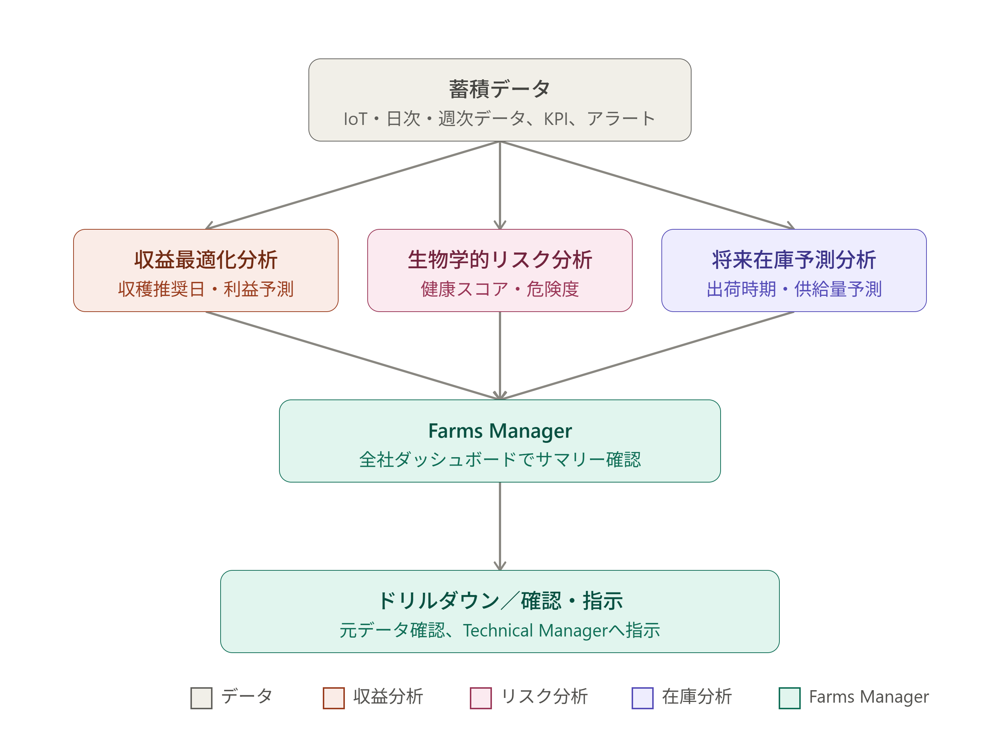

# 業務要件書

### 対象：エビ養殖場統合管理システム

## 1. プロジェクト概要

- **システム概要**：IoTセンサー・データ分析を用いたインドネシアエビ養殖場向け階層型（Farms Manager／Technical Manager）統合管理Webシステム
- **対象企業・対象養殖池の概要**：インドネシア国内に複数のエステート（各エステート内に数十〜数百の池）を有するエビ養殖企業。Farms Managerは都市部（ジャカルタ等）、養殖現場は地方に分散
- **背景**：広大な土地に分散する複数ファームの状況をリアルタイムに把握できず、異常発生時の経営インパクトの見積もりや、収穫タイミング・出荷計画の精度確保が困難な状況にある

---

## 2. 現状の課題（As-Is）

- **現在の養殖管理業務の流れ**：現場で目視・簡易測定によるモニタリングを実施し、状況を管理棟・Farms Managerへ報告する体制（デジタル連携は未整備）
- **現状の記録方法とその問題点**：
  - 広大な土地に分散するファームの状況がリアルタイムで把握できない
  - 現場ごとの報告精度・運用状況にばらつきがあり、出荷計画の精度が安定しない
  - 現場データ（給餌・死亡・水質・成長）が経営判断に使える形に整理されておらず、収穫タイミングや出荷計画の判断が経験則に依存している
- **過去に発生した問題とその原因の仮説**：
  - 水質悪化（DO低下等）の予兆にFarms Manager・現場双方が気づくのが遅れ、対応が後手に回る
  - Farms Manager側が各ファームの詳細状況を把握できず、異常時・収穫時期の経営判断が遅れる

## 3. システム化の目的・ゴール

- **システム化の目的**：現場IoTセンサー・日次入力・週次サンプリングから得られるデータを、Farms ManagerとTechnical Managerそれぞれに必要な粒度・形式（Farms Manager＝分析結果、現場＝詳細データ）に整理して提供し、全社レベルでの経営判断と現場レベルでの迅速な異常対応を両立させる
- **達成すべきゴール**：
  - Farms Managerが全国のファームの状態を一目で把握し、閾値超過や異常が発生したファームにすぐ気づける状態の実現
  - Farms Managerが池ごとの収穫推奨タイミング・利益予測、生物学的リスクの状態、将来の出荷可能量を分析結果として確認できる状態の実現
  - Technical Managerが自ファームのIoTデバイスからの詳細な数値を確認し、閾値超過アラートを受け取って迅速に対応できる状態の実現
  - 現場で得られるIoTデータの変化をAIが学習・予測し、Technical Managerの判断を助けるアドバイスを提示できる状態の実現
  - Technical Managerが日々の池の状態（生存数・死亡数・天候等）および週次サンプリング結果を報告できる仕組みを整える
  - 閾値超過等の条件に応じてアクチュエーター（ポンプ・エアレーション等）をPID制御し、Technical Managerが遠隔から状態監視・承認・オーバーライドできる状態の実現

---

## 4. スコープ定義

### 4.1 対象範囲（In Scope）

- Farms Manager統合ダッシュボード（全ファームの状態一覧、サマリー表示）
- Farms Manager向け分析結果表示（収益最適化、生物学的リスク、先行営業・将来在庫予測の3領域）
- 分析結果から元データへのドリルダウン機能
- Technical Manager向けモニタリング画面（自ファーム内の池ごとのIoT詳細データ確認、閾値超過アラート受信）
- 3〜5分間隔でのIoTセンサーデータ収集
- 閾値超過に基づくアラート機能
- 日次報告書の入力機能（Technical Manager）
- 週次サンプリング・ラボ検査結果の入力機能、および関連KPI（ABW・ADG・SR・Biomass・FCR・COGS等）の自動算出
- IoTデータの変化を学習したAIによる予測・アドバイス提示機能（Technical Manager向け）
- アクチュエーター（ポンプ・エアレーション等）に対するPID制御機能（PID制御・Safety Layer）、およびTechnical Managerによる監視・承認・オーバーライド機能

### 4.2 フェーズ分け

- **Phase 1**：ルールベースのKPI算出・収益シミュレーション・将来在庫予測（まず「見える化・説明可能性」を確立）
- **Phase 2**：異常検知・生物学的リスクスコアの導入（十分な履歴データが蓄積された段階で検証）
- **Phase 3**：機械学習による予測の高度化（モデル方式はデータ量・精度検証結果を踏まえて選定）

---

## 5. 前提条件・制約条件

- **前提条件**：
  - 各池に防水型IoTセンサー（スマートプローブ）が設置され、DO・pH・水温・濁度・TDS・水位等が自動計測されていること
  - 各池にポンプ・エアレーション等のアクチュエーターが設置され、システムからの制御信号を受けられること
  - 週次サンプリング（体重測定・尾数計測）が現場運用として実施されること
- **技術的制約**：
  - 3〜5分間隔の連続データ送信に耐えうる通信・サーバー設計が必要
- **法規制・データ主権**：インドネシア国内の個人情報保護法（PDP法）、データの越境移転可否の確認が必要
- **言語**：Technical Manager向けはインドネシア語必須、Farms Manager向けはインドネシア語／英語併記を想定
- **開発体制**：開発チームは2名。設計・実装・検証はAgentic SDLC（後述17章）に基づき、AIエージェントを活用して進める想定
- **想定インフラ**：クラウド基盤としてGCP（Google Cloud Platform）を想定。センサーデータはEdge経由でGCPへ送信される構成を前提とする
- **業務ルールの確定が必要な項目**：利益の定義（粗利／営業利益等）、市場価格の更新ルール、収穫判断の優先順位、リスク閾値、AIが推奨してよい範囲、供給予測の扱い（予測値か安全余裕を見た販売可能量か）等は、企業側との合意により確定する

---

## 6. ステークホルダー・利用者定義

| 役割              | 説明                                                                                                                                                  | 見える情報の粒度                                                                                                                     | システム上の権限イメージ                                                                                                                                     |
| ----------------- | ----------------------------------------------------------------------------------------------------------------------------------------------------- | ------------------------------------------------------------------------------------------------------------------------------------ | ------------------------------------------------------------------------------------------------------------------------------------------------------------ |
| Farms Manager     | 都市部Farms Managerから全国のファーム群を一元的に把握する経営責任者。営業・テクニカル担当者が同じダッシュボードを利用する想定も含む（権限差は要確認） | 全ファームの状態一覧、および池・ファーム単位の分析結果（収益最適化、生物学的リスク、将来在庫予測）。生データそのものは原則表示しない | 全社ダッシュボード閲覧、分析結果からのドリルダウン閲覧                                                                                                       |
| Technical Manager | 自ファーム内の池を管理する現場責任者                                                                                                                  | 自ファーム内の池ごとのIoTデバイス詳細数値（DO・pH・水温等）、閾値超過アラート、AIによる予測アドバイス                                | 自ファームの詳細モニタリング閲覧、アラート確認、AIアドバイス閲覧、日次報告書・週次サンプリングの入力、自動制御の監視・承認・オーバーライド（Human Override） |

---

## 7. 業務要件

### 7.1. データ収集・入力

* IoTセンサーから各池の環境データを自動収集する
* Technical Managerが給餌量・死亡数・サンプリング結果などを入力する

### 7.2. 状態把握・分析

* システムが収集・入力されたデータを統合する
* 水質・生育状況・養殖KPIなどを確認できるようにする
* 異常やリスクがある場合はTechnical Managerへ通知する

### 7.3. 現場対応

* Technical Managerが池の状態や通知内容を確認する
* 必要に応じて給餌・設備制御・その他の現場対応を行う
* システムは設備制御を支援し、制御状況を記録する

### 7.4. AI・予測支援

* 蓄積されたデータをもとに水質・生育・リスクなどを分析・予測する
* AIがTechnical Managerに対応案を提示する
* Technical Managerが予測・提案を確認し、対応を判断する

### 7.5. ファーム横断管理

* Farms Managerが複数ファームの状況を確認する
* 収益・生物リスク・将来出荷などの分析結果を確認する
* 必要に応じて詳細情報を確認し、Technical Managerへ確認・指示を行う

#### Farms Managerの業務フロー図

#### Technical Managerの業務フロー図

※Technical Managerの業務フロー図は後日追加予定。

---

### 8. 企業側に確定してもらう主な業務ルール（要確認事項）

- 利益の定義（粗利／営業利益／限界利益のいずれを最適化対象とするか）
- 市場価格の更新頻度・有効期間・最低価格等のルール
- 収穫判断における優先順位（サイズ・利益・病気リスク・契約・物流制約等）
- 正常／注意／警告を分けるリスク閾値
- AIが推奨してよい範囲と、人間の承認が必須となる範囲
- 将来供給量を「予測値」とするか「安全余裕を差し引いた販売可能量」とするかの扱い
- SR・FCR・COGS等のKPIの正式な定義（何を含め、何を分母とするか）

---

## 9. 開発体制・進め方（Agentic SDLC）

> システム設計書（ShrimpOS Agentic SDLC 基本設計）に基づく、本システムの開発体制・進め方の要点

- **開発チーム規模**：2名
- **基本方針**：Humanが「何を・なぜ作るか」を決定し、AIエージェントが「どう実現するか」を担当する。ただし重要な意思決定はHumanが承認する
- **エージェント構成**：

| Agent            | 役割                                          |
| ---------------- | --------------------------------------------- |
| Management Agent | 全体管理・タスクの振り分け・進行状況の管理    |
| Design Agent     | 要件整理・システム設計・API／DB／UI設計       |
| Data/ML Agent    | IoTデータ設計・特徴量設計・MLモデル設計・評価 |
| Builder Agent    | ソースコード・インフラ・MLパイプラインの実装  |
| Verify Agent     | 実装・設計・MLモデルの独立した検証            |

- **基本フロー**：Human → Management Agent → Design Agent／Data-ML Agent → Builder Agent → Verify Agent → Human（最終承認）
- **Humanによる承認が必要な事項**：
  - システム設計（Architecture）の変更
  - 重要なDB／API変更
  - MLモデルの本番採用
  - PID制御ルールの導入
  - 本番環境への重要な変更
- **本業務要件書との関係**：本書（業務要件書）はDesign Agentの入力・成果物の一つと位置づけられ、今後の設計変更はこの業務要件書の更新とHumanの承認を経て反映される想定
